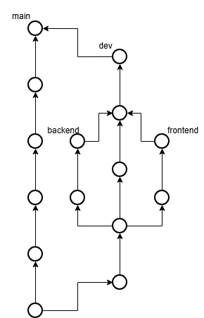

# Statusbericht Kollegen - 18.11.2025
Wir konnten gut ins Projekt starten, alle haben Mitglieder haben eine Arbeit zugeteilt bekommen. Die Arbeit wird über Kanban getrackt, Git-Commits werden regelmässig erstellt. Zusätzlich haben wir uns für ein Monorepo & Polybranch-Strategie entschieden. Wir sind zuversichtlich und schreiten stetig vorran.

## Arbeitsumfang pro Person
| Person                | Arbeitsumfang            |
|-----------------------|--------------------------|
| **Janik**                 | Ideenfindung, Projektplanung, Projektsetup, Mockup,                      |
| **Pascal**                | Ideenfindung, Projektplanung, Projektsetup, Mockup                  |
| **Benjamin**              | Ideenfindung, Projektplanung, Projektsetup, Kanban, Konzept, Statusbericht         |
| **Julian**                | Ideenfindung, Projektplanung, Projektsetup, Backend-structure, git-repository                   |

## Nächste Aufgaben
- Mockup fertigstellen
- Konzept fertigstellen
- Backend-routen definieren
- DB-struktur
- Authentication
- Planung
- DevOps grösserer Fokus

## Risiken
Bis jetzt sind keine Risiken bekannt, die Verwendung von GitHub Action kann möglicherweise etwas Einarbeitungszeit in Anspruch nehmen. Somit ist DevOps unsere grösste Sorge, jedoch kein Risiko.

## Fragen
- keine Fragen

## GitHub und Kanban
- Einladung wurd an rajethan.ranjan@sluz.ch verschickt.
- Einladungslink [Kanban](https://miro.com/welcomeonboard/WGw5Tlk2aGxjd08rV0htMUVrQmpZMVZIcUVJTDdtaURKYW1iOTREYkFnZXVUbjJPV0t2OTZ1TFQ3YlVjWTM2dFR5Y0ViSzBlS2RzYUdwVlkvUUZxa005SWx3RWhSOCtuYXZHSEc3YnRBVEduNzlMZDVxS20waDdFd1dmY1FwUmhBd044SHFHaVlWYWk0d3NxeHNmeG9BPT0hdjE=?share_link_id=956695441724)
- Konzept Git-Struktur:  

